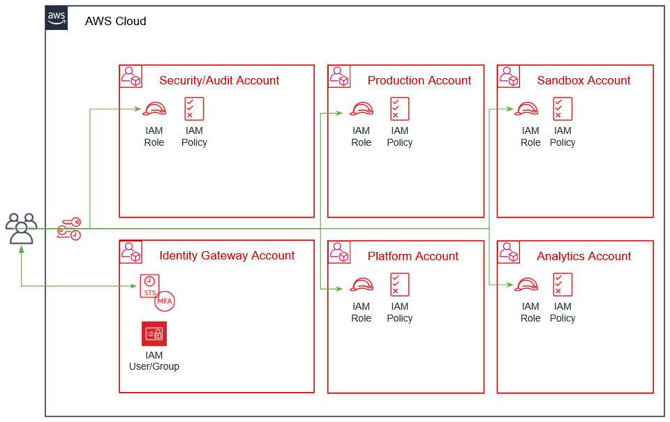

# Passport
[Passport](https://github.com/Young-ook/terraform-aws-passport) is a project for fine-grained multi-aws account role switching platform. It supports baseline security policies and best practicies. There is identity gateway account we called `badge` account for management of user identity and group membership to allow users to assume to the authorized role in the target AWS account. The target account we called `bespoke` account is purpose built AWS account. We can transform that account to run the production environment resources only. Also, we can make the bespoke account to the control tower of the whole network configuration for the organization. In this case, allowed administators can touch the VPC resources and share them to the other `bespoke` accounts to use them. Passport is very flexible for categorization of AWS acouunt to meet the requirement from organization.



Individual users can assume cross-account roles defined in IAM policies attached to IAM groups in the `badge` account. For example, if a user belongs to the `DataScientist` IAM group in the `badge` account, the user can switch to the `DataScientist` role in the `Data Analytics` account if there is a policy to assume that role. In this case, `Data Analytics` is one of the `bespoke` accounts. You can also create `Developer` role to give sandbox accounts full access, but restrict access to production environments.

What is important thing in this system is that only `Security` role can manage role mapping rules for the `badge` account. Recommend 3 users to have `Security` role for applying configuration and policy changes. It is necessary to establish a rule so that the permission policy can be updated only with the approval of at least 1 out of 3 security engineers.

## Examples
- [Multi-Account RBAC with AWS IAM: badge account](https://github.com/Young-ook/terraform-aws-passport/blob/main/examples/badge)
- [Multi-Account RBAC with AWS IAM: bespoke account](https://github.com/Young-ook/terraform-aws-passport/blob/main/examples/bespoke)

## Getting started
### AWS CLI
Follow the official guide to install and configure profiles.
- [AWS CLI Installation](https://docs.aws.amazon.com/cli/latest/userguide/cli-chap-install.html)
- [AWS CLI Configuration](https://docs.aws.amazon.com/cli/latest/userguide/cli-configure-profiles.html)

### Terraform
Infrastructure Engineering team is using terraform to build and manage infrastucure for DevOps. And we have a plan to migrate cloudformation termplate to terraform.

To install Terraform, find the appropriate package (https://www.terraform.io/downloads.html) for your system and download it. Terraform is packaged as a zip archive and distributed as a single binary. Install Terraform by unzipping it and moving it to a directory included in your system's `PATH`.

And there is an another option for easy install. The [tfenv](https://github.com/tfutils/tfenv) is very useful solution.
You can use this utility to make it ease to install and switch terraform binaries in your workspace like below.
```
$ tfenv install 0.12.18
$ tfenv use 0.12.18
```
Also this tool is helpful to upgrade terraform v0.12. It is a major release focused on configuration language improvements and thus includes some changes that you'll need to consider when upgrading. But the version 0.11 and 0.12 are very different. So if some codes are written in older version and others are in 0.12 it would be great for us to have nice tool to support quick switching of version.
```
$ tfenv list
$ tfenv use 0.12.18
$ tfenv use 0.11.14
$ tfenv install latest
$ tfenv use 0.12.18
```
