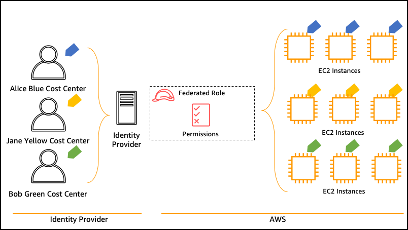

# Attribute Based Access Control (ABAC)
Passport is a terraform module for Cross-Account Identity and Access Management on AWS. For more details, please visit the [Passport](https://github.com/Young-ook/terraform-aws-passport) project page.



## Download example
Download this example on your workspace
```sh
git clone https://github.com/Young-ook/terraform-aws-passport
cd terraform-aws-passport/examples/abac
```

## Setup
[This](https://github.com/Young-ook/terraform-aws-passport/blob/main/examples/abac/main.tf) is an example of Attribute-Based Access Control (ABAC) terraform configuration file. To build your AWS account as a badge account, clone the example and run terraform apply.

Run terraform:
```sh
terraform init
terraform plan (optional)
terraform apply
```
Also you can use the `-var-file` option for customized paramters when you run the terraform plan/apply command.
```
terraform plan -var-file fixture.tc1.tfvars
terraform apply -var-file fixture.tc1.tfvars
```

This command will create users and groups on the `badge` account with group and role mappings. After applying this, individual users will have access to base line roles and polcies.

## Verify
This example creates users in your account.

Don't forget after the first login your IAM user, you must enable MFA (Multi-Factor Authenticator) in your account before you switch a role.

## Clean up
Run terraform:
```
terraform destroy
```
Don't forget you have to use the `-var-file` option when you run terraform destroy command to delete the aws resources created with extra variable files.
```
terraform destroy -var-file fixture.tc1.tfvars
```
