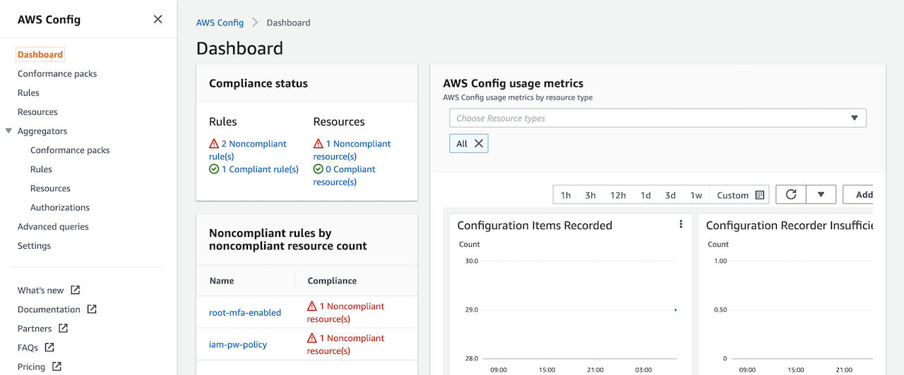
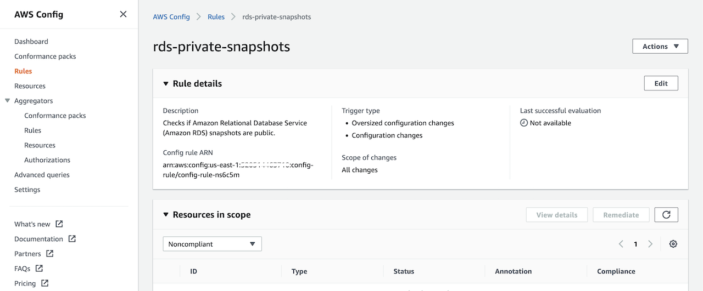

# Baseline
There are a few different ways to interpret what defines baseline security. According to the National Institute of Standards and Technology (NIST), a “security control baseline” refers to  “the set of minimum security controls defined for a low-impact, moderate-impact, or high-impact information system. Microsoft, on the other hand, identifies security baselines simply as standards defined by individual organizations that apps and devices must be compliant with.
This is an example of a security assurance approach that formalizes AWS account design, automates security controls, and streamlines auditing. In this example, you can learn how to check your environment against security industry standards and best practices.

## Download example
Download this example on your workspace
```sh
git clone https://github.com/Young-ook/terraform-aws-passport
cd terraform-aws-passport/examples/baseline
```

## Setup
[This](https://github.com/Young-ook/terraform-aws-passport/blob/main/examples/baseline/main.tf) is an example of terraform configuration file to create identity gateway account with baseline security policies. To build your AWS account as a badge account, clone the example and run terraform apply.

Run terraform:
```sh
terraform init
terraform apply
```
This module creates roles in the `bespoke` account for cross-role switching and baseline security rules to prevent disallowed software package installation.

## Verify
AWS Config Compliance Dashboard


AWS Config Rules


AWS Config Rule: RDS Private Snapshot


## Clean up
Run terraform:
```
terraform destroy
```
Don't forget you have to use the `-var-file` option when you run terraform destroy command to delete the aws resources created with extra variable files.
```
terraform destroy -var-file tc1.tfvars
```
