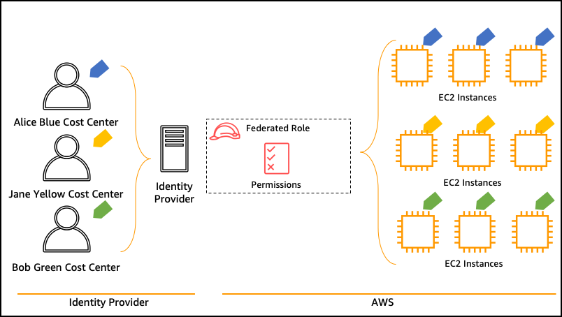
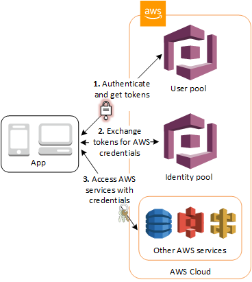

[[English](README.md)] [[한국어](README.ko.md)]

# Passport Blueprint
[Passport](https://github.com/Young-ook/terraform-aws-passport) is a terraform module for Cross-Account Identity and Access Management on AWS. This is Passport Blueprint example helps you compose complete fine-grained multi AWS accounts that are fully bootstrapped with utilities that is needed to deploy and operate workloads. With this Passport Blueprint example, you describe the configuration for the desired state of your access control using Role-based Access Control (RBAC) and Attribute-based Access Control (ABAC) policy for your aws resources, as an Infrastructure as Code (IaC) template/blueprint. Also, you describe the configuration for the desired baseline and guardrail for security. Once a blueprint is configured, you can use it to keep your AWS environment clear and secure like landing zone using your automation workflow tool, such as Jenkins, CodePipeline. Passport Blueprint also helps you implement relevant security controls needed to operate workloads from multiple teams with centralized control tower.

## Setup
### Download
Download this example on your workspace
```
git clone https://github.com/Young-ook/terraform-aws-passport
cd terraform-aws-passport/examples/blueprint
```

Then you are in **blueprint** directory under your current workspace. There is an exmaple that shows how to use terraform configurations to create and manage IAM roles and additional utilities, such as Role Switch Tracker, on your AWS account. Check out and apply it using terraform command. If you don't have the terraform tools in your environment, go to the main [page](https://github.com/Young-ook/terraform-aws-passport) of this repository and follow the installation instructions before you move to the next step.

Run terraform:
```
terraform init
terraform apply
```
Also you can use the *-var-file* option for customized paramters when you run the terraform plan/apply command.
```
terraform plan -var-file fixture.tc1.tfvars
terraform apply -var-file fixture.tc1.tfvars
```

## AWS Accounts
### Badge account
Badge AWS account is an identity gateway in a passport architecture where all user-role mappings accross accounts are managed. First, we have to create a **badge** account for baseline.
```
terraform apply --target module.badge
```

### Bespoke account(s)
Bespoke AWS account is an account that we create for a specific purpose whthin the passport architecture. Bespoke allows users of the badge account, identity gateway, to assume into roles in bespoke account, such as adminstrator, data scientist, developer. Those roles in bespoke account can only be access by badge account users. Run terraform apply to create roles to the **bespoke** account. The developer role with read-only access policy and the rescue role with admin access policy will be created in the bespoke account for your application deployment.
```
terraform apply --target module.bespoke
```

Finally, run the following command to associate the resources created in each account in the previous step. This command updates the user-group-role mapping in the badge account.
```
terraform apply
```

This module creates users and groups in the badge account with group and role mappings. And also, it creates roles in the bespoke account for cross-role switching. However, in this example, we are using the same aws account for simple testing.

### RBAC (Role-based Access Control)
This example creates iam users in your badge account. You will find *joe* in the user list where in the IAM service page. You can switch to the *rescue* or *developer* role of the bespoke account if you are singed in as *joe* credential on AWS Console. Don't forget you must enable MFA (Multi-Factor Authenticator) of your user before you try to switch a role. Follow the [instructions](https://docs.aws.amazon.com/IAM/latest/UserGuide/id_credentials_mfa_enable_virtual.html) to enable MFA device. Also, you can sign-in as *tom* to manage idnetity configurations (AWS IAM) on your badge account. You can switch to the *security-office* role taht has adminiatrative permission after signing-in *tom*.

### ABAC (Attribute-based Access Control)
This example creates users in your account. Don't forget after the first login your IAM user, you must enable MFA (Multi-Factor Authenticator) in your account before you switch a role.



## Role Switching Tracker
**WatchApp** ia an event-driven serverless application for user activity (especially role switching with administrative roles) tracking. This example uses Amazon EventBridge to detect an IAM role switching event, such as an IAM API call, and uses AWS Lambda function to send a notification via Slack. In this example uses *aws-events* module to build predefined application for AWS Event management. For more details, please visit the [page](https://github.com/Young-ook/terraform-aws-eventbridge/blob/main/modules/aws-events).

In this example, slack integration requires two sensitive credentials: `slack webhook url` and `slack channel id`. Prepare your credentials before running this example and pass them to the variable when running terraform apply with a custom variable. And if you want to know about the details on how to protect your sensitive variables using terraform, please refer to this [document](https://learn.hashicorp.com/tutorials/terraform/sensitive-variables?in=terraform/0-14).

After **WatchApp** has been deployed, you can start tracking for role switching in your badge account. When a developer user changed his/her role to the *develper* or *rescue* you will receive a message on slack channel that you integrated with **WatchApp**. To test if the user activity tracker is working well, try to sign-in as a developer user with MFA token. Then, change your role to *developer* or *rescue* by following this [guide](https://docs.aws.amazon.com/IAM/latest/UserGuide/id_roles_use_switch-role-console.html). Don't forget you must enable MFA (Multi-Factor Authenticator) of your user before you try to switch a role.

## Baseline
There are a few different ways to interpret what defines baseline security. According to the National Institute of Standards and Technology (NIST), a “security control baseline” refers to  “the set of minimum security controls defined for a low-impact, moderate-impact, or high-impact information system. Microsoft, on the other hand, identifies security baselines simply as standards defined by individual organizations that apps and devices must be compliant with. With Blueprint, you describe a configuration for the desired state of a security assurance approach that formalizes AWS account design, automates security controls, and streamlines auditing. In this example, you can learn how to check your environment against security industry standards and best practices and how to apply baseline security rules to prevent disallowed software package installation.

AWS Config Compliance Dashboard


AWS Config Rules


AWS Config Rule: RDS Private Snapshot


## Cognito IdP



## Clean up
To destroy all infrastrcuture, run terraform:
```
terraform destroy
```

If you don't want to see a confirmation question, you can use quite option for terraform destroy command
```
terraform destroy --auto-approve
```

**[DON'T FORGET]** You have to use the *-var-file* option when you run terraform destroy command to delete the aws resources created with extra variable files.
```
terraform destroy -var-file fixture.tc1.tfvars
```
