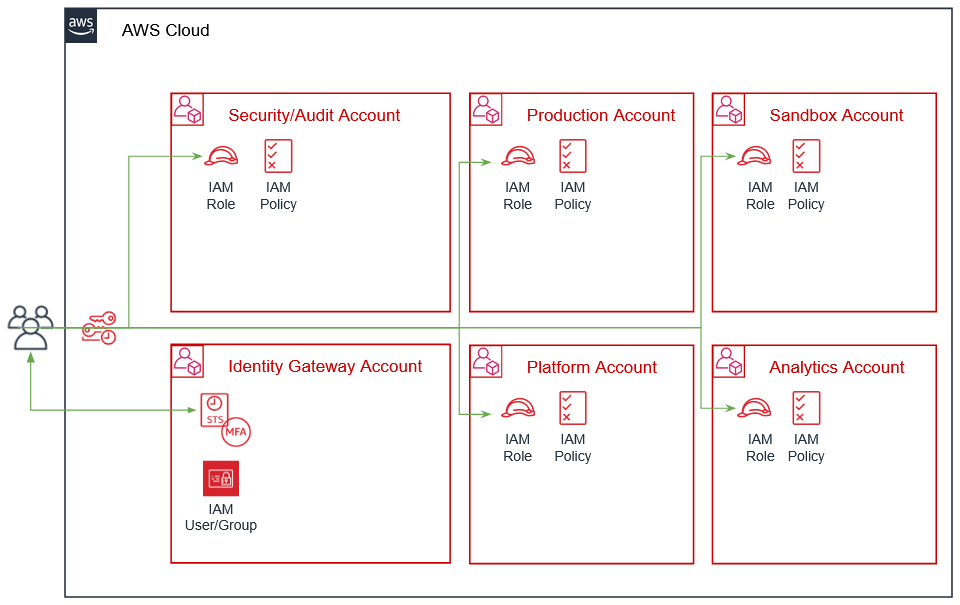

# Passport
[Passport](https://github.com/Young-ook/terraform-aws-passport) is a project for fine-grained multi-aws account role switching platform. It supports baseline security policies and best practicies. There is identity gateway account we called `badge` account for management of user identity and group membership to allow users to assume to the authorized role in the target AWS account. The target account we called `bespoke` account is purpose built AWS account. We can transform that account to run the production environment resources only. Also, we can make the bespoke account to the control tower of the whole network configuration for the organization. In this case, allowed administators can touch the VPC resources and share them to the other `bespoke` accounts to use them. Passport is very flexible for categorization of AWS acouunt to meet the requirement from organization.



Individual users can assume cross-account roles defined in IAM policies attached to IAM groups in the `badge` account. For example, if a user belongs to the `DataScientist` IAM group in the `badge` account, the user can switch to the `DataScientist` role in the `Data Analytics` account if there is a policy to assume that role. In this case, `Data Analytics` is one of the `bespoke` accounts. You can also create `Developer` role to give sandbox accounts full access, but restrict access to production environments.

What is important thing in this system is that only `Security` role can manage role mapping rules for the `badge` account. Recommend 3 users to have `Security` role for applying configuration and policy changes. It is necessary to establish a rule so that the permission policy can be updated only with the approval of at least 1 out of 3 security engineers.

## Setup
This is an example to explain how to build and deploy badge and bespoke accounts. And it shows that how to add users and manage the policy to give access to them via terraform configuration. [This](main.tf) is the example of terraform configuration file to create IAM users, groups and role on multiple AWs accounts. Check out and apply it using terraform command.

### Create a badge account
First, we have to build a badge account for baseline of identity gateway.

Run terraform:
```
terraform init
terraform apply -target module.badge -var-file tc1.tfvars
```
Also you can use the `-var-file` option for customized paramters when you run the terraform plan/apply command.
```
terraform plan -var-file default.tfvars
terraform apply -var-file default.tfvars
```

### Create a bespoke account
Run terraform:
```
terraform init
terraform apply -target module.bespoke -var-file tc1.tfvars
```
After all, user will see the generated IAM roles.

## Clean up
Run terraform:
```
$ terraform destroy
```
Don't forget you have to use the `-var-file` option when you run terraform destroy command to delete the aws resources created with extra variable files.
```
$ terraform destroy -var-file default.tfvars
```
